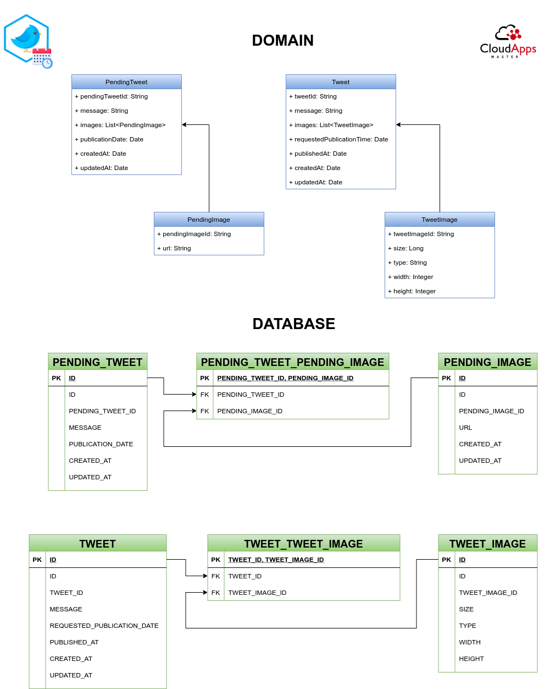

# Design proposal

## Domain and database

## REST API

| VERB   	| PATH                           	| ERRORS                                                       	|
|--------	|--------------------------------	|--------------------------------------------------------------	|
| GET    	| /pending                       	|                                                              	|
| GET    	| /pending/{id}                  	| NOT_FOUND                                                    	|
| GET    	| /pending/{startDate}/{endDate} 	| END_DATE_EARLIER_THAN_START_DATE                             	|
| POST   	| /pending                       	| MAX_LENGTH_EXCEEDED, IMAGE_NOT_FOUND, EXPIRED_DATE           	|
| PUT    	| /pending/{id}                  	| NOT_FOUND, MAXLENGTH_EXCEEDED, IMAGE_NOT_FOUND, EXPIRED_DATE 	|
| DELETE 	| /pending/{id}                  	| NOT_FOUND                                                    	|
| GET    	| /tweet                         	|                                                              	|
| GET    	| /tweet/{id}                    	| NOT_FOUND                                                    	|
| GET    	| /tweet/{startDate}/{endDate}   	| END_DATE_EARLIER_THAN_START_DATE                             	|
| GET    	| /actuator/info                 	|                                                              	|
| GET    	| /actuator/info                 	|                                                              	|
