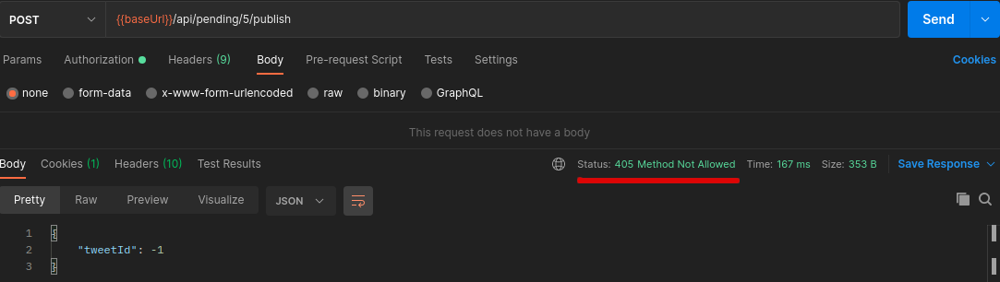

# Refactor: publish on demand

## Add new feature toggle

On `Features.java` add new feature toggle:

```
	@Label("Publish on demand")
	PUBLISH_ON_DEMAND
```

It is disabled by default


## Add V2 flyway script

Include script `V2__add_publication_type.sql` with new column and setting default value as `SCHEDULED`

```
ALTER TABLE TWEET
ADD PUBLICATION_TYPE varchar(255) DEFAULT 'SCHEDULED' NOT NULL
```

## Add REST endpoint to controller but returning 405 and hide it from OpenApi documentation

As it is described [here](https://www.baeldung.com/spring-swagger-hiding-endpoints#hiding-an-endpoint-with-hidden), any REST method can be hidden using `@Hidden` annotation when OpenApi v3 is used:

```
@Hidden
	@Operation(
			summary = "Publish a pending tweet immediately", 
			description = "Publish a pending tweet immediately", 
			tags = { "pending" })
    @ApiResponses(value = { 
        @ApiResponse(responseCode = "200", description = "pending tweet successfully published",
                content = @Content(schema = @Schema(implementation = PublishOnDemandResponse.class))),
        @ApiResponse(responseCode = "404", description = "pending tweet not found"),
        @ApiResponse(responseCode = "405", description = "Feature in progress") })
	public ResponseEntity<PublishOnDemandResponse> publishOnDemand(@PathVariable Long id);
```

But method is reachable as it is shown:



Tests added:

- Mapper: PublishOnDemandResponseMapperTest (unitary)
- Controller: check that 405 is returned as httpStatus
    - PendingApiControllerTest.publishOnDemandPendingTweetTest() (unitary)
    - PendingApiControllerIT.publishOnDemandPendingTweetTest() (integration)

## Add publicationType to JPA Tweet entity

Publication type has two possible values: SCHEDULED and ON_DEMAND, so best choice to model it is using an enum that later will be used in domain:

```
public enum PublicationType implements ValueObject {

	SCHEDULED,
	ON_DEMAND
}
```

As it is described [here](https://www.baeldung.com/jpa-persisting-enums-in-jpa#string) in order to use this enum in JPA:

```
	@Enumerated(EnumType.STRING)
	private PublicationType publicationType;
```

## Add publicationType to domain

## Add publicationType to service

## Add publicationType to controller

## Enable feature toggle

## Remove feature toggle