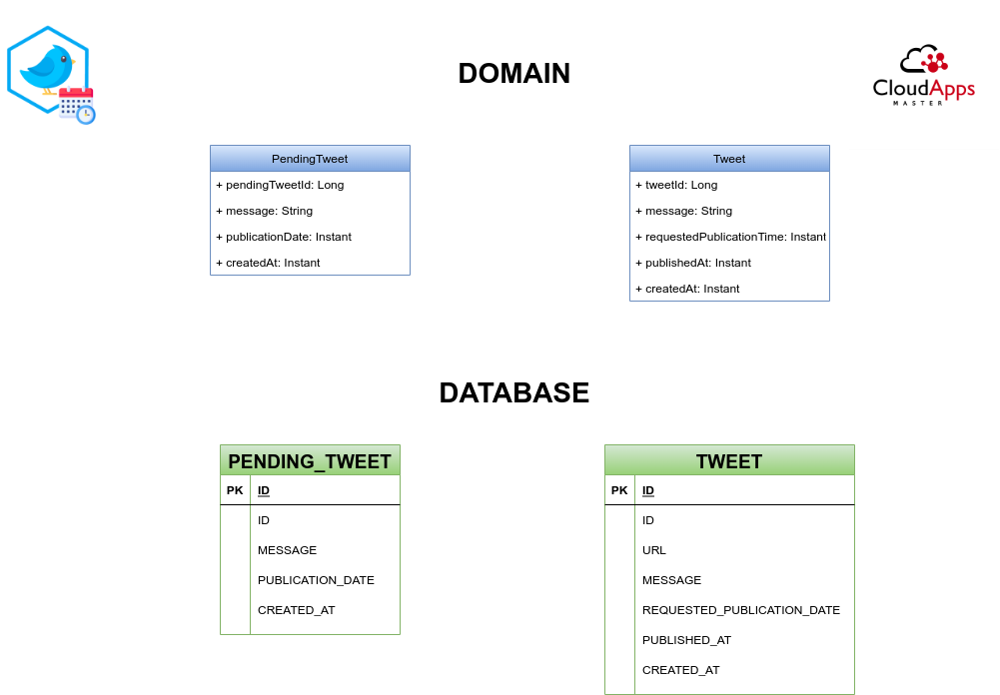
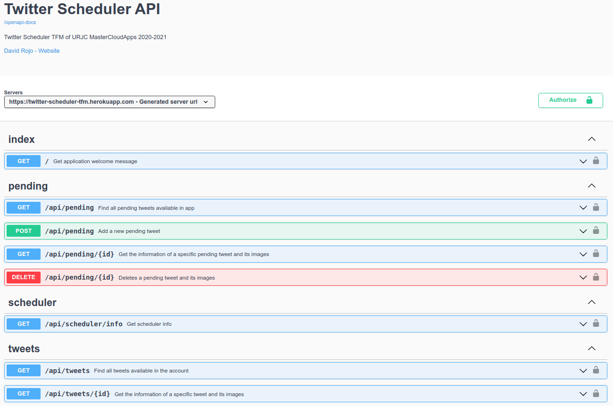
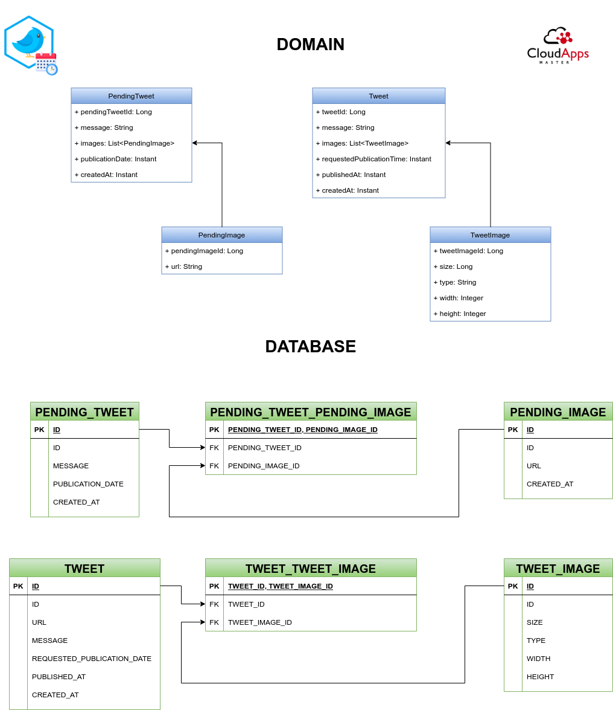

# 19/11/2021: Follow up

## Progress

- Togglz used for feature toggles instead of FF4J
- Smoke tests
- Postgre/Flyway
- Using Heroku DB
- Profiles: STANDALONE/PRO
- Integration tests
- Publish scheduled only text tweets

## Questions/Issues

- Refactor proposals:
  - Include feature for publish tweets with images
  
  - Include new endpoint to publish specific pending tweet, it will be recovered by pendingTweetId. A new DB column called `publication_type` will be added to Tweet table, available values will be `automatic` or `manual`
- TFM presentation:
  - December 5th (Sunday): submit TFM memory, maybe it can be send two days later
  - December 17th (Friday afternoon): TFM presentation. Remote or face2face.
  - If not possible to present in December, contact with University in order to enroll for 2021-2022 (7 €), tentative presentation dates for April-May. Deadline middle of next week.
- TDD
- Awaitility (Scheduled IT)
- TwitterServiceImplTest JUNIT