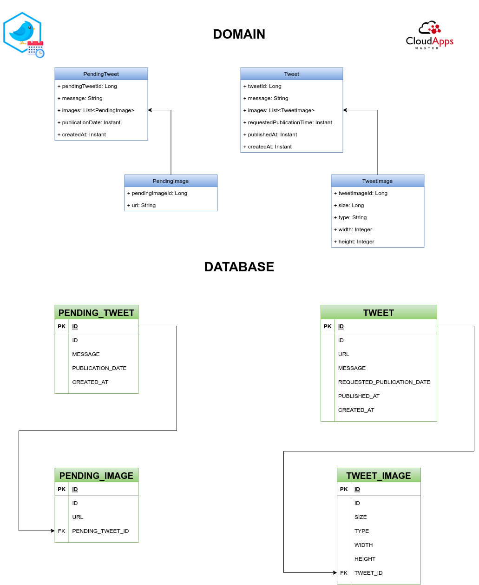

# 29/11/2021: Follow up

## Features

### Publish tweets on demand

Include new endpoint to publish specific pending tweet, it will be recovered by pendingTweetId. A new DB column called `publication_type` will be added to Tweet table, available values will be `automatic` or `manual`

[Steps](../design/feature-publish-on-demand.md)

### Publish tweets with images

[Steps](../design/feature-tweets-with-images.md)

## Documentacion

[Normativa de Trabajo de Fin de Master – Curso 2020-21](https://www.aulavirtual.urjc.es/moodle/pluginfile.php/9157822/mod_resource/content/0/Normativa%20de%20TFM%202020-2021.pdf)

### Memoria académica

La memoria académica es un documento en PDF que describa el proyecto realizado. Esta memoria tendrá una longitud mínima de 15 páginas y estará escrita en castellano. La estructura de la memoria podrá inspirarse en los siguientes apartados:

- Portada
- Resúmen (1 página)
- Capítulo de Introducción y objetivos
- Capítulo o capítulos en los que se desarrolle el TFM
- Capítulo de Conclusiones y trabajos futuros
- Bibliografía
- Anexos (Opcionales. No incluidos en la longitud de 15 páginas como mínimo)

El formato de la portada se encuentra publicado junto a esta normativa.

### Documentación técnica

La documentación técnica está destinada a desarrolladores software que quieran hacer uso o ampliar el trabajo de fin de máster. Podrá realizarse en castellano o inglés y deberá incluir diagramas, diseños, especificaciones técnicas y todos aquellos detalles relevantes para el trabajo.

Esta documentación técnica deberá tener una estructura y formato adecuados en función de la naturaleza del proyecto. Por ejemplo, la documentación podría ser un sitio web, un conjunto de ficheros en Markdown en el repositorio git del proyecto, etc.

La memoria académica puede incluir parte de la documentación técnica y/o hacer referencia a ella

### Entrega y defensa del TFM

La entrega consiste en subir al aula virtual la memoria del proyecto y en publicar esa memoria en PDF y con un formato editable (docx, tex, odt...) en una carpeta docs del repositorio de código. Esta memoria deberá publicarse con licencia Creative Commons Attribution Share-Alike

En el momento de la entrega la documentación técnica también debería estar finalizada. Además, el código del repositorio debería estar también estable.

La defensa es un acto en el que el alumno presenta su trabajo a un tribunal y a cualquier persona que esté interesada en asistir. Para ello el alumno utilizará una presentación (slides) y preferiblemente realizará una demostración en vivo del proyecto. 

La presentación utilizada en el acto de defensa deberá publicarse también en la carpeta docs del repositorio una vez finalizada dicha defensa. Se publicará tanto en PDF como en un formato editable. Esta presentación deberá publicarse con licencia Creative Commons Attribution Share-Alike.

